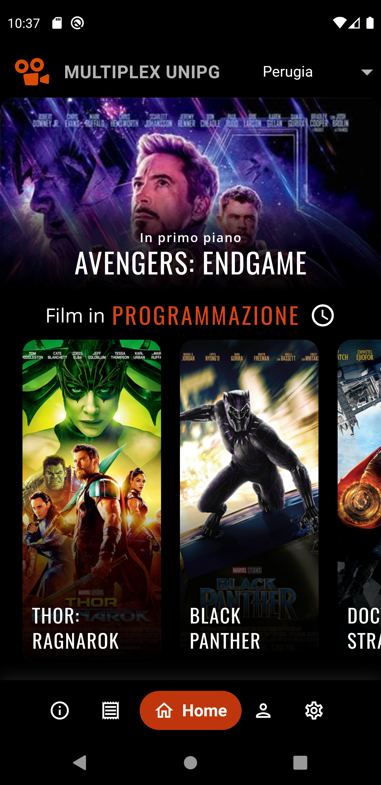
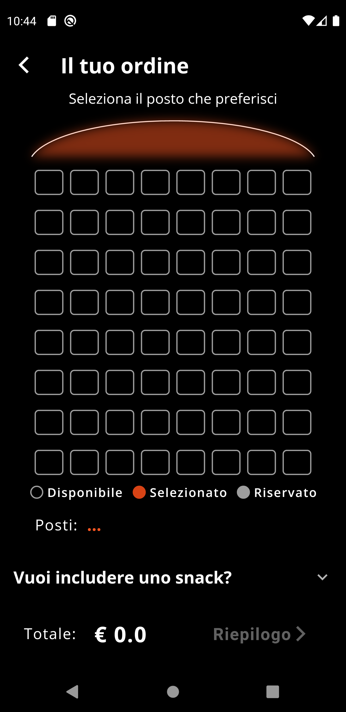
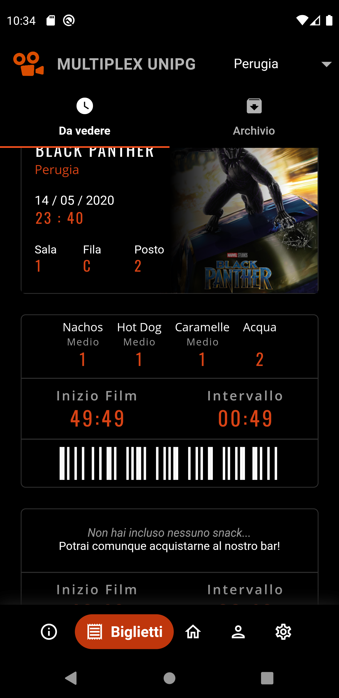
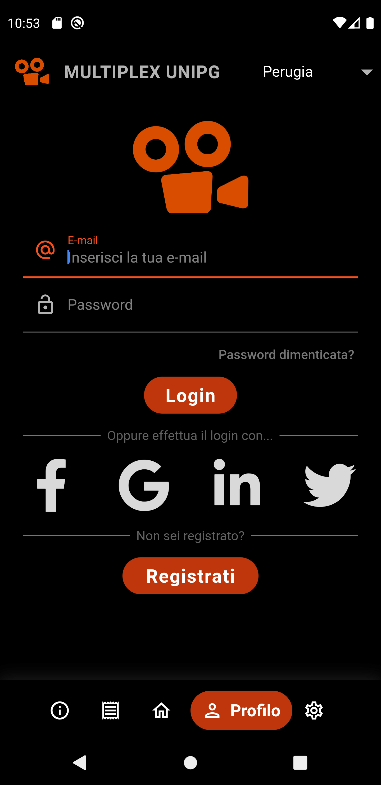

# Multiplex UniPG

   
   
  <i>Multiplex UniPG is a mobile application to provide an innovative experience for purchasing and managing movie tickets.</i>

## 📷 Screenshots

    
    
    
    

 

## 📚 Description's project
The application, through a well-designed system, intends to bring an objective simplification to the user, providing the following features:
- Consultation of films in scheduling;
- Consultation and selection of date, time and type of vision;
- Purchase of tickets, with the selection of seats and addition of snacks;
- Consultation of all the tickets purchased, dividing them into "to see" and "archive";
- Arrangement of customized timers for each ticket, indicating:
  - Movie start countdown;
  - Countdown to the end of the interval.
- Consultation of contacts and information specific to the cinema chain;
- Registration and Login for users, visualization of their profile;
- Support for two themes to enhance the experience: Light Mode, Dark Mode.

## 👨‍💻 Developers
Project architecture, UI Design & initial implementation in Flutter:
- [Alessio Amatucci](https://github.com/Alexius22)
- [Antonio Strippoli](https://github.com/CoffeeStraw)

UI statefull widgets implementations, Code optimizations, Firebase services integrations, Back-end:
- [Antonio Strippoli](https://github.com/CoffeeStraw)
